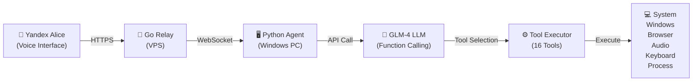

# Home Alice v2 🏠

**Control your Windows PC entirely through Yandex Alice voice commands**

A fully-integrated voice-controlled PC automation system that lets you switch windows, manage processes, browse the web, control audio, type text, and execute commands — all by talking to Yandex Alice.

## Quick Overview

```
Yandex Alice → Go Relay (VPS) → Python Agent (Windows PC) → GLM-4 LLM → 16 PC Control Tools
```

Home Alice v2 is a three-component system that bridges voice commands from Yandex Dialogs to your Windows PC. The AI agent interprets natural language using the GLM-4 LLM and executes actions through a comprehensive set of control tools.

## Architecture



## Key Features

### 16 Integrated Tools

| Category | Tools | Description |
|----------|-------|-------------|
| **System** | Shutdown, Reboot, Sleep, Get Info | Full system control |
| **Windows** | List, Switch, Close Windows | Window management |
| **Browser** | Open URLs, Search VK Videos | Web interaction |
| **Audio** | Set Volume, Mute | Audio control (0-100%) |
| **Keyboard** | Press Hotkeys, Type Text | Input simulation |
| **Process** | List, Kill Processes | Process management |
| **Commands** | Execute Whitelisted Shell Commands | System automation |

### Natural Language Processing

The Python agent leverages **GLM-4 LLM** with function calling to:
- Parse natural language voice commands in Russian and English
- Automatically select the right tool for each command
- Handle multi-step operations and context
- Return natural language responses

### Automatic Reconnection

- WebSocket client with intelligent reconnection logic
- Survives network interruptions
- Automatic retry with 5-second backoff
- Full logging for debugging

## Tech Stack

| Component | Technology | Version | Purpose |
|-----------|-----------|---------|---------|
| **Relay Server** | Go | 1.22+ | VPS-hosted WebSocket proxy (~100 lines) |
| **Agent** | Python | 3.11+ | Windows PC controller |
| **LLM** | GLM-4 | via API | Free LLM with function calling |
| **Voice Interface** | Yandex Dialogs | - | Voice input/output |
| **Communication** | WebSockets | - | Real-time message passing |
| **Libraries** | websockets, openai, psutil, pywin32, pycaw, pyautogui | - | Core functionality |

## Project Structure

```
home_alice/
├── relay/                      # Go relay server
│   ├── main.go                # WebSocket proxy (~100 lines)
│   ├── go.mod                 # Go module definition
│   └── relay                  # Compiled binary
│
├── agent/                      # Python PC agent
│   ├── main.py               # Entry point with WebSocket client
│   ├── config.py             # Configuration loader (YAML)
│   ├── llm_client.py         # GLM-4 integration with function calling
│   ├── tool_executor.py      # Routes function calls to 16 tools
│   ├── config.example.yaml   # Configuration template
│   ├── requirements.txt       # Python dependencies
│   └── tools/                # Tool implementations
│       ├── system.py         # System operations
│       ├── windows.py        # Window management
│       ├── browser.py        # Browser control
│       ├── audio.py          # Audio operations
│       ├── keyboard.py       # Keyboard input
│       └── process.py        # Process management
│
├── tests/                      # Test suite
│   ├── test_config.py         # Config tests (1 test)
│   ├── test_system_tools.py   # System tools tests (4 tests)
│   ├── test_window_tools.py   # Window tools tests (4 tests)
│   ├── test_browser_tools.py  # Browser tools tests (6 tests)
│   ├── test_audio_tools.py    # Audio tools tests (6 tests)
│   ├── test_keyboard_tools.py # Keyboard tools tests (4 tests)
│   ├── test_process_tools.py  # Process tools tests (5 tests)
│   └── test_llm_client.py     # LLM integration tests (2 tests)
│
├── docs/                       # Documentation
│   └── plans/                 # Design and implementation plans
│
├── PROGRESS.md                # Implementation progress
└── README.md                  # This file
```

## Installation

### Prerequisites

- **Windows PC:** Windows 10/11 with Python 3.11+
- **Linux VPS:** Any Linux distribution with Go 1.22+
- **Yandex Account:** For Yandex Dialogs skill
- **GLM-4 Account:** Register at https://open.bigmodel.cn/ (free tier available)

### Step 1: Deploy Go Relay (on VPS)

```bash
# Clone or download the relay code
cd relay

# Build the binary
go build -o relay .

# Run with environment variables
LISTEN_ADDR=:8443 \
API_KEY=your-secret-key \
TLS_CERT=/path/to/cert.pem \
TLS_KEY=/path/to/key.pem \
./relay
```

**Environment Variables:**
- `LISTEN_ADDR`: Address to listen on (default: `:8443`)
- `API_KEY`: Secret key for agent authentication (required)
- `TLS_CERT`: Path to TLS certificate (for HTTPS)
- `TLS_KEY`: Path to TLS private key (for HTTPS)

**Health Check:**
```bash
curl https://your-vps.com/health
# Returns: {"status":"ok","agent_connected":true/false}
```

### Step 2: Setup Yandex Dialogs

1. Go to https://dialogs.yandex.ru/developer/
2. Create a new skill
3. Set the webhook URL to: `https://your-vps.com/alice/webhook`
4. Enable skill in your Yandex account

### Step 3: Install Python Agent (on Windows PC)

```bash
# Install dependencies
pip install -r agent/requirements.txt

# Copy and edit configuration
cp agent/config.example.yaml agent/config.yaml

# Edit config.yaml with your settings:
# - GLM-4 API key
# - Relay server URL
# - API key (matching relay's API_KEY)
```

**Configuration (config.yaml):**
```yaml
server_url: "wss://your-vps.com/ws"
api_key: "your-secret-key"

llm:
  provider: "glm4"
  api_key: "your-glm4-api-key"
  base_url: "https://open.bigmodel.cn/api/paas/v4"
  model: "glm-4"

vk_token: ""  # Optional: for VK video search

allowed_commands:
  - "ipconfig"
  - "systeminfo"
  - "tasklist"
```

### Step 4: Run the Agent

```bash
# Start the agent
python -m agent.main

# Or with custom config path
CONFIG_PATH=/path/to/config.yaml python -m agent.main
```

**Output:**
```
2026-02-14 10:30:45,123 [INFO] agent.main: Connecting to wss://your-vps.com/ws
2026-02-14 10:30:45,456 [INFO] agent.main: Connected to relay server
2026-02-14 10:30:52,789 [INFO] agent.main: Received command: переключи на Chrome
2026-02-14 10:30:52,890 [INFO] agent.main: Result: Переключился на Chrome
```

## Usage Examples

Try these voice commands with Yandex Alice:

### System Control
- **"Алиса, выключи компьютер"** → Shuts down PC
- **"Алиса, перезагрузи компьютер"** → Reboots PC
- **"Алиса, усыпи компьютер"** → Sleep mode
- **"Алиса, системная информация"** → Shows OS, CPU, RAM info

### Window Management
- **"Алиса, переключи на Chrome"** → Switches to Chrome window
- **"Алиса, закрой Visual Studio"** → Closes VS window
- **"Алиса, покажи все окна"** → Lists all open windows

### Browser Control
- **"Алиса, открой YouTube"** → Opens YouTube in default browser
- **"Алиса, открой github.com"** → Opens GitHub
- **"Алиса, найди видео про котиков"** → Searches VK for cat videos

### Audio Control
- **"Алиса, громкость 50"** → Sets volume to 50%
- **"Алиса, увеличь звук на 10"** → Increases volume by 10%
- **"Алиса, отключи звук"** → Mutes audio

### Keyboard & Text
- **"Алиса, напечатай привет"** → Types "привет"
- **"Алиса, нажми Windows + D"** → Presses Win+D (show desktop)
- **"Алиса, нажми Alt + Tab"** → Switches between windows

### Process Management
- **"Алиса, список процессов"** → Shows running processes
- **"Алиса, закрой Google Chrome"** → Kills Chrome process

## API Reference

### WebSocket Message Format

**Agent → Relay:**
```json
{
  "id": "session-123-1",
  "text": "переключи на Chrome"
}
```

**Agent ← Relay:**
```json
{
  "id": "session-123-1",
  "text": "Переключился на Chrome"
}
```

### Tool Definition (for LLM)

All 16 tools are defined with JSON schemas for function calling:
```python
tools = [
    {
        "type": "function",
        "function": {
            "name": "shutdown_pc",
            "description": "Shutdown the Windows PC",
            "parameters": {
                "type": "object",
                "properties": {...},
                "required": [...]
            }
        }
    },
    # ... 15 more tools
]
```

## Testing

The project includes **32 automated tests** with 100% pass rate.

```bash
# Run all tests
pytest tests/ -v

# Run specific test file
pytest tests/test_system_tools.py -v

# Run with coverage
pytest tests/ --cov=agent --cov-report=html
```

**Test Summary:**
- ✅ 1 config test
- ✅ 4 system tools tests
- ✅ 4 window management tests
- ✅ 6 browser tools tests
- ✅ 6 audio tools tests
- ✅ 4 keyboard tools tests
- ✅ 5 process tools tests
- ✅ 2 LLM client tests

All tests use mocking to avoid actual system operations.

## Environment Variables

### Agent
- `CONFIG_PATH`: Path to YAML config file (default: `agent/config.yaml`)

### Relay Server
- `LISTEN_ADDR`: HTTP server address (default: `:8443`)
- `API_KEY`: Authentication key for agent (required)
- `TLS_CERT`: Path to TLS certificate
- `TLS_KEY`: Path to TLS private key

## Troubleshooting

### Agent can't connect to relay
- Check relay is running: `curl https://your-vps.com/health`
- Verify `server_url` and `api_key` in config.yaml match relay settings
- Check firewall allows WebSocket connections to port 8443

### LLM API errors
- Verify GLM-4 API key is correct
- Check API quota at https://open.bigmodel.cn/
- Ensure base_url matches your region

### Commands not executing
- Check agent console for error messages
- Run tests: `pytest tests/ -v`
- Enable debug logging by modifying logging.basicConfig

### VK video search fails
- Set valid `vk_token` in config.yaml
- VK tokens require specific permissions for video search

## API Keys & Registration

### GLM-4 (Required)
1. Visit https://open.bigmodel.cn/
2. Sign up and verify phone number
3. Create API key in user dashboard
4. Add to config.yaml

### Yandex Dialogs (Required)
1. Create account at https://yandex.com/
2. Go to https://dialogs.yandex.ru/developer/
3. Create new skill and configure webhook

### VK Token (Optional)
1. Create app at https://dev.vk.com/
2. Get access token with video permission
3. Add to config.yaml to enable video search

## Development

### Adding a New Tool

1. Create file in `agent/tools/` with implementation
2. Add tool definition to `llm_client.py`
3. Add executor route in `tool_executor.py`
4. Write tests in `tests/test_*.py`
5. Run: `pytest tests/ -v`

### Debug Logging

Edit `agent/main.py`:
```python
logging.basicConfig(
    level=logging.DEBUG,  # Change from INFO
    format="%(asctime)s [%(levelname)s] %(name)s: %(message)s",
)
```

## Performance

- **Relay latency:** <100ms (simple proxy)
- **Agent response time:** 1-4 seconds (depends on LLM)
- **WebSocket reconnection:** <5 seconds
- **Memory usage:** ~50MB (agent), <5MB (relay)

## Known Limitations

- **Windows only:** Agent runs on Windows PC (pywin32, pycaw dependencies)
- **Single agent:** Relay supports only one active agent at a time
- **Command timeout:** Alice webhook has 4-second timeout
- **Network dependent:** Requires stable internet connection
- **Regional:** GLM-4 API may have regional restrictions

## Security Considerations

- **API Key:** Use strong, unique API keys for `api_key`
- **TLS:** Always use TLS in production (HTTPS)
- **Allowed Commands:** Whitelist shell commands in config
- **Network:** Run relay behind reverse proxy (nginx, HAProxy)
- **Firewall:** Restrict agent IP in relay firewall rules

## Project Status

✅ **Complete** - All 13 implementation tasks finished

The Home Alice v2 system is production-ready with:
- Full implementation of all 16 tools
- Comprehensive test suite (32 tests, 100% pass)
- Proper error handling and logging
- WebSocket reconnection logic
- Function calling LLM integration

## License

[Add your license here - MIT, Apache 2.0, etc.]

## Contributing

Contributions welcome! Please:
1. Write tests first (TDD)
2. Ensure all tests pass: `pytest tests/ -v`
3. Follow existing code style
4. Add documentation for new features

## Support

For issues and questions:
- Check [PROGRESS.md](./PROGRESS.md) for implementation details
- Review design documents in [docs/plans/](./docs/plans/)
- Check test files for usage examples

---

**Made with** ❤️ **for hands-free PC control**
